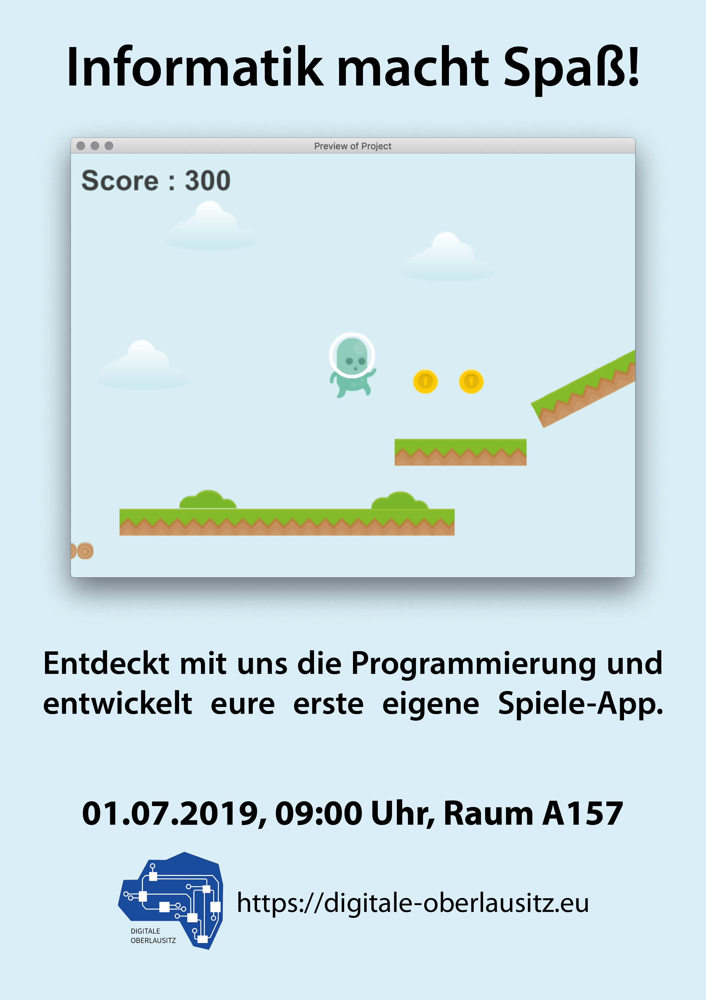

Am 01. Juli organisieren wir einen Workshop zur Spieleprogrammierung für Schüler des BSZ Görlitz. 
Gemeinsam mit den Schülern wollen wir ein einfaches Jump-and-Run-Spiel auf Basis von [GDevelop](https://gdevelop-app.com/) bauen.

