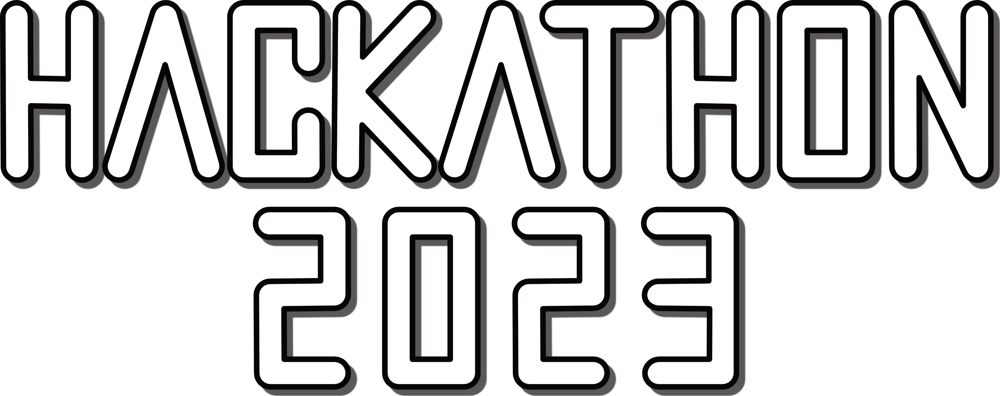

Der Verein Digitale Oberlausitz e.V., ansässig in Görlitz, setzt sich dafür ein, Technik und Informatikwissen für alle
zugänglich zu machen. Wir sehen uns als eine Plattform für kreativen Austausch und Weiterbildung und haben es uns zur
Aufgabe gemacht, die digitale Transformation aktiv mitzugestalten.

Zum zweiten Mal organisieren wir unseren Hackathon, einen kollaborativen Programmierwettbewerb, der sich an alle
richtet, die Interesse daran haben, echte Probleme durch kreative digitale Lösungen anzugehen. Unser diesjähriger
Hackathon steht unter dem Zeichen der Smart City, und die Challenge besteht darin, kreative und nützliche Anwendungen
für Sensordaten in einer städtischen Umgebung zu entwickeln.

In der Smart City Challenge 2023 fordern wir Teams dazu auf, ihre eigenen Ideen zur Verbesserung des städtischen Lebens
durch geschickte und kreative Datenerhebung und -auswertung zu erarbeiten. Wir stellen dafür Sensoren, Mikrocontroller
und Cloud-Zugänge zur Verfügung. Diese können in unterschiedlichsten Bereichen genutzt werden - sei es in der
städtischen Infrastruktur, in den Rathäusern oder bei den Bürgerinnen und Bürgern. Es gibt keine Beschränkungen, was die
Art der Lösung oder die Art des Problems angeht. Die einzige Voraussetzung ist, dass es einen Mehrwert für die Stadt und
ihre Bürgerinnen und Bürger bietet.

Dabei sind nicht nur technisch versierte Teilnehmerinnen und Teilnehmer gefragt. Wir ermutigen auch Nicht-Techniker,
sich zu beteiligen, denn Technologie allein schafft noch keine Smart City - dazu braucht es ebenso kreative Ideen und
Menschen, die sie umsetzen wollen.

Neben der eigentlichen Challenge bietet der Hackathon auch die Möglichkeit, sich mit Gleichgesinnten zu treffen, sich
auszutauschen und eine tolle Zeit zu haben. Es ist auch eine Gelegenheit, mit lokalen Unternehmen und Institutionen in
Kontakt zu kommen und vielleicht zukünftige Partnerschaften oder Karrieremöglichkeiten zu entdecken.

Wir suchen sowohl Sponsoren als auch Teilnehmer*innen, um diesen spannenden und zukunftsorientierten Wettbewerb zu
ermöglichen. Als Sponsor haben Sie die Chance, Ihre Marke in einem innovativen und technologieorientierten Umfeld zu
präsentieren. Teilnehmer*innen haben die Möglichkeit, ihr Wissen und ihre Fähigkeiten in einem realen Kontext anzuwenden
und dabei einen Beitrag zur Gestaltung unserer digitalen Zukunft zu leisten.

Seien Sie Teil unserer Mission, eine digitale Oberlausitz zu gestalten und melden Sie sich für unseren Hackathon 2023
an!

Wann: 20. - 22. Oktober 2023  
Wo: UnbezahlbarLounge, Bahnhofstraße 22, 02826 Görlitz  
Mehr Infos: https://hackathon2023.digitale-oberlausitz.eu
