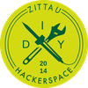

Unsere Freunde vom Polytechnischen Werkraum Zittau feiern ihr 10-jähriges Bestehen und wir möchten die Einladung gerne
teilen:

> Am Sa 07.09.2024 feiert der Werkraum sein 10-jähriges Bestehen und möchte dies gemeinsam mit dem Freiraum Zittau e.V.
> tun, um die vielfältigen Möglichkeiten und Aktivitäten, die das Wächterhaus bietet, zu präsentieren.
>
> Geplant ist ein vielfältiges Programm mit Vorträgen und Workshops des Werkraums am Nachmittag und Musik am Abend.

**Termin**: Samstag 07.09.2024

**Adresse**:
[Innere Weberstraße 17, 02763 Zitta](https://www.openstreetmap.org/?mlat=50.89725&mlon=14.80431#map=19/50.89725/14.80431)

Weitere Infos findet ihr unter:

- https://chaoskunstgefrickel.werkraum.space/
- Mastodon: https://chaos.social/@werkraum

Wenn ihr von Görlitz aus eine Fahrgemeinschaft sucht, dann meldet euch gerne unter vorstand@digitale-oberlausitz.eu
