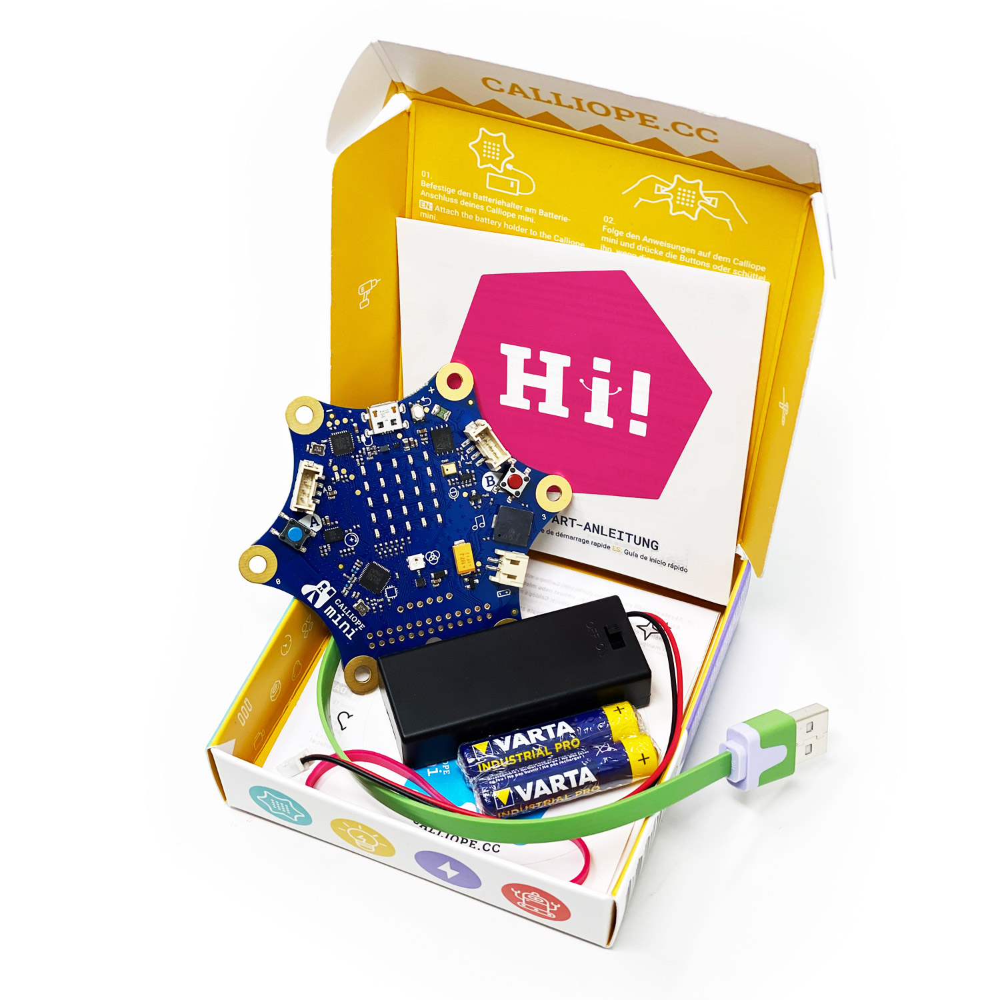

Der [Calliope Mini](https://calliope.cc) ist ein handlicher Mikrocontroller, der speziell für Bildungszwecke entwickelt wurde. Er ermöglicht es Schülern, spielerisch die Grundlagen des Programmierens und der digitalen Welt zu erlernen. In meinem Vortrag wird Justus Markert Calliope Mini V2 und V3 und die gängigen Editoren Microsoft MakeCode und Open Roberta vorstellen.

Zeit: 05.08.2024 ab 18:30 Uhr
Ort: 
[Lutherstraße 50 (Eckhaus, Ladengeschäft mit großen Fenstern an der Ecke), 02826 Görlitz](https://www.openstreetmap.org/?mlat=51.14581&mlon=14.97133#map=19/51.14581/14.97133 "Eintrag der Adresse auf Open Street Maps")

<!--more-->

Ein wichtiger Fokus des Vortrags liegt auf dem didaktischen Ansatz des Calliope Mini, der darauf abzielt, das Interesse an MINT-Fächern zu steigern und die Fähigkeit der Schüler zu fördern, die Welt um sie herum zu verstehen und sich mit Problemstellungen auseinanderzusetzen.

Neben dem Bildungsbereich wird auch der Einsatz des Calliope Mini in Unternehmen thematisiert, insbesondere seine Unterstützung bei Grundschul-AGs, eines Oberschul-Projekts und seine Verwendung bei Schülerpraktika. Dabei reicht die Bandbreite der Zielgruppen von Anfängern bis zu fortgeschrittenen Schülern.

Ein weiterer praktischer Teil des Vortrags wird das Programmieren mit JavaScript umfassen, bei dem eine kleine Animation erstellt wird, um den Teilnehmern die Verwendung von Schleifen und anderen Konzepten zu vermitteln.

Abschließend wird Raum für offene Diskussionen und Erfahrungsaustausch geboten.

