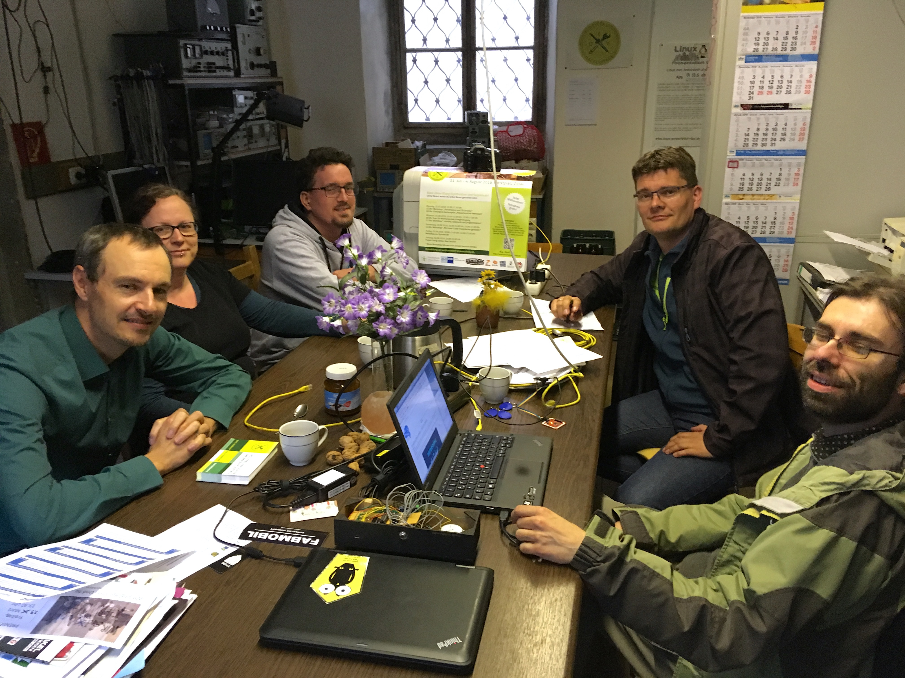

Am 23. April 2019 waren wir zu Besuch im "Polytechnischen Werkraum Zittau". 
Der Werkraum befindet sich in dem vom "Freiraum Zittau e.V." betreuten 
Wächterhaus in der Inneren Weberstraße 16 in Zittau.

Zunächst bekamen wir eine kleine Führung durch das Haus, welches von außen recht unscheinbar aussieht,
sich von innen aber als erstaunlich vielseitig herausstellt. 
Viele verschlungene Wege durch Gänge und über Treppen verbinden unterschiedlichste Räume, die für verschiedene Zwecke
genutzt werden können. Einer der größeren Räume wurde beispielsweise schon häufiger für
künstlerische Ausstellungen genutzt, diente aber auch schon mal als Treffpunkt für einen Linux-Presentation-Day.
In einem anderen Raum befindet sich eine Holzwerkstatt und einige Treppen weiter fanden wir uns im Werkraum wieder.
Uns hat vor allem beeindruckt, wie sehr doch das Haus einen gewissen Gründergeist versprüht und
voller Möglichkeiten zu stecken scheint.   

Das Konzept eines "Wächterhauses" sieht vor, dass ein gemeinnütziger Träger ein ungenutztes Haus von der Stadt 
zur Verfügung gestellt bekommt, zum einen um das Haus vor einem drohendem Verfall zu bewahren, vor allem aber auch,
um es für sinnvolle Zwecke für die Allgemeinheit nutzbar zu machen. 
Genau dieser Zweck wird durch den Freiraum Zittau e.V. umgesetzt.

Im Werkraum finden zum Einen Workshops und Treffen für verschiedenste Gruppen und Initiativen statt, beispielsweise
ein OpenStreetMap-Stammtisch, die Linux-User-Group Zittau, Repair-Café und weitere Treffen von Gleichgesinnten.
Zum anderen soll der Werkraum auch für konkrete Projekte genutzt werden. 
Die technische Ausstattung dazu ist beeindruckend: Neben Werkbänken und dazugehörigen Holz- und Metall-Werkzeugen steht auch eine Drechsel-Bank
und sogar eine CNC-Fräse zur Verfügung. Auch für Computer-Basteleien ist der Werkraum ganz gut ausgerüstet.

Bei Kaffee und guter Laune berichteten uns einige der Organisatoren des Freiraums von vergangenen Veranstaltungen und zukünftig geplanten
Projekten. Auch wir vom Digitale-Oberlausitz e.V. haben unsere bisherigen Aktivitäten sowie unsere Vision vorgestellt.
Dabei wurde schnell klar, dass uns viele Gemeinsamkeiten und eine ähnliche Motivation verbinden, auch wenn die Ausgangssituationen unterschiedlich 
sind. Daher haben wir natürlich auch mögliche Anknüpfungspunkte und Möglichkeiten zum Austausch und zur Zusammenarbeit besprochen und sehen
eine sehr vielversprechende gemeinsame Zukunft vor uns.

In einem ersten Schritt wollen wir gegenseitig auf die Veranstaltungen des jeweils anderen hinweisen um so eines der größten Probleme für Initiativen
wie die unsrigen anzugehen: Wie erreicht man potentielle Interessenten für die eigenen Angebote, um eine möglichst große Beteiligung hinzubekommen?
Und das in einer ländlich geprägten Region und mit einer Zielgruppe - Informatikerinnen, Techniker, Hacker usw. - der man ein eher geringes 
Interesse an sozialer und persönlicher Interaktion nachsagt?

Wir werden daher in Zukunft auch Veranstaltungen des Werkraum Zittau in unserer [Events-Liste](/events) aufführen und hin und wieder Einladungen 
über unsere Mailing-Liste weiterleiten. 
An dieser Stelle sei deshalb auch auf die Online-Präsenz des Werkraums verwiesen:

Eine Beschreibung des polytechnischen Werkraum Zittau findet sich auf der Website 
[https://werkraum.freiraumzittau.de/](https://werkraum.freiraumzittau.de).
Aktuelle Termine können stets in der [Termin-Übersicht](https://werkraum.freiraumzittau.de/wiki/werkraum:termine:aktuell) nachvollzogen werden
und darüber hinaus lohnt es sich, die Mailinglisten des Vereins zu abonnieren. Hier steht die [allgemeine Liste des Werkraums](https://lists.freiraumzittau.de/mailman/listinfo/hackerspace)
sowie die der [Linux-User-Group Zittau](https://lists.freiraumzittau.de/mailman/listinfo/lug-zi) zur Verfügung.
Außerdem wollen wir in Zukunft nach Möglichkeit Fahrgemeinschaften von Görlitz nach Zittau organisieren um gemeinsam vor Ort an Veranstaltungen 
teilnehmen zu können.

Darüber hinaus wollen wir in Zukunft auch gemeinsame Projekte und Veranstaltungen realisieren. 
Dazu gehört zum Beispiel ein regelmäßiger Linux-Presentation-Day, der abwechselnd in Görlitz und Zittau stattfinden könnte. 
Außerdem gibt es Ideen, technische Vorträge auch in kleinere Ortschaften in der Umgebung zu wiederholen. 

Wir sind gespannt, was die Zukunft ergibt und freuen uns auf eine gute Zusammenarbeit. 
