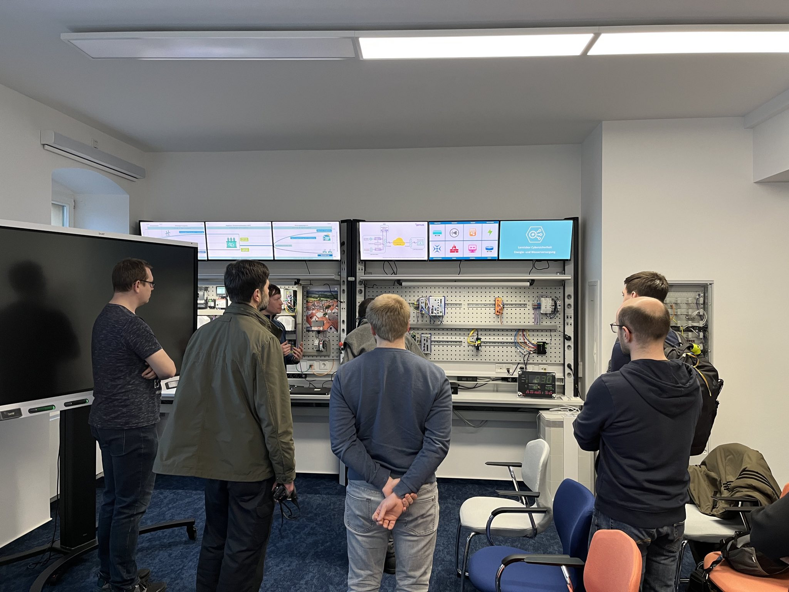
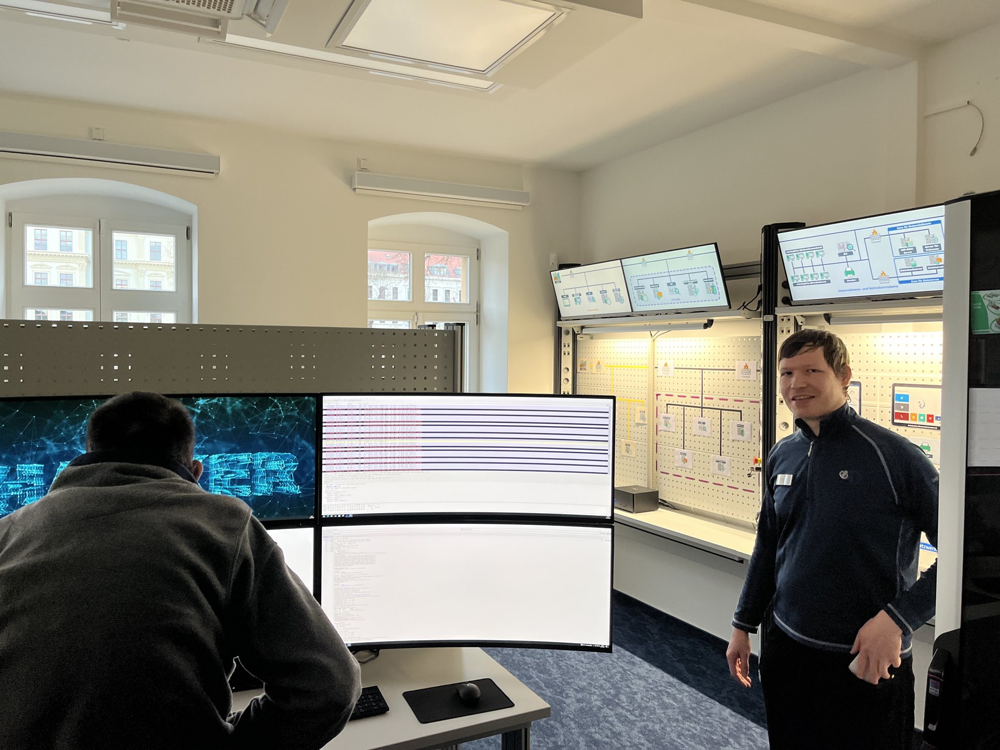

Heute war der *Digitale Oberlausitz e. V.* im Rahmen der Veranstaltung [Spring für architekturinteressierte Entwickler:innen](https://www.jug-gr.de/talks/2023-03-29-spring_fuer_architekturinteressierte_entwickler_innen/) der *Java User Group Görlitz* beim *Fraunhofer-Institut IOSB für Angewandte Systemtechnik* in Görlitz zu Gast. Dankenswerterweise konnten wir vor unserem eigentlichen User-Group-Meeting von den Mitarbeitern des Instituts einen Einblick in die spannende Arbeit des Fraunhofer Instituts in Görlitz gewinnen. Für uns gab es eine kleine Führung durch das Lernlabor mit einem Vortrag über mögliche (und bereits geschehene) Angriffe auf existierende IT-Infrastrukturen diverser IT-Systeme von z. B. kommunalen oder privat-wirtschaftlichen Anlagen. 

Was genau wird im Lernlabor gemacht? Das Lernlabor Cybersicherheit des Fraunhofer IOSB-AST am Standort Görlitz vermittelt neueste Methoden und Erkenntnisse zum Thema IT-Sicherheit in der Energie- und Wasserversorgung. Es bringt aktuelle Forschungsergebnisse praxisnah und anwendungsorientiert in Form von Seminaren und technischen Intensivkursen in die Wirtschaft. 

<!--more-->

In hochwertig ausgestatteten Laboren mit realen Arbeitsumgebungen können Fach- und Führungskräfte IT-Sicherheit hautnah erleben: Beispielsweise bei Hacker-Angriffen auf die Leitstelle eines Kraftwerks oder etwa bei der Aufklärung von Cyberspionage mit den Werkzeugen der IT-Forensik. Durch die eigene Erfahrung können sich die Teilnehmenden wertvolles Wissen aneignen, direkt ausprobieren, Fehler machen – und sogar selbst einmal in die Rolle eines Hackers schlüpfen, um dessen Perspektive nachzuvollziehen. Als Basis dient die Laborinfrastruktur mit der Nachbildung eines virtuellen Energie- und Wasserversorgungsunternehmens (Stadtwerk). Dessen Netzwerkkommunikation sowie der Einsatz realer IT- und OT-Komponenten ermöglichen praxisnahe Trainings zu den Themen Cybersicherheit, Monitoring, Angriffserkennung, Fernwartung/-zugriff sowie Angriffsvektoren und entsprechenden Schutzmaßnahmen. Die aktuellen Forschungsschwerpunkte des Lernlabors Cybersicherheit am Standort Görlitz liegen im Bereich der Cyber-Resilienz, der richtlinienbasierten Evaluierung von IT/OT-Infrastrukturen sowie der Automatisierung von Gap-Analysen und Pentests.

Spannend, was wir heute Abend hören durften. Schaut auch mal auf der [Website des Fraunhofer-Standorts Görlitz](https://www.iosb-ast.fraunhofer.de/de/abteilungen/kognitive-energiesysteme/lernlabor-cybersicherheit-energie-wasserversorgung.html) des Fraunhofer-Standorts Görlitz rein. Auch dort gibt es einen großartigen Überblick über die Inhalte, die wir heute live, überblicksartig vermittelt bekamen. 

Allgemein gesprochen, ist im digital-wissenschaftlichen Bereich in Görlitz einiges in Bewegung und es ist wirklich großartig zu sehen, wie sich das wissenschaftliche Ökosystem der Stadt Görlitz entwickelt hat und auch weiter entwickelt. In dem Kontext wird es sicher auch in Zukunft noch weiteres zu berichten geben.