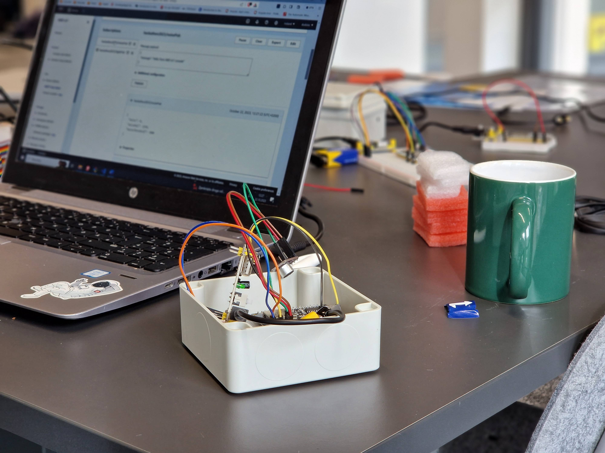
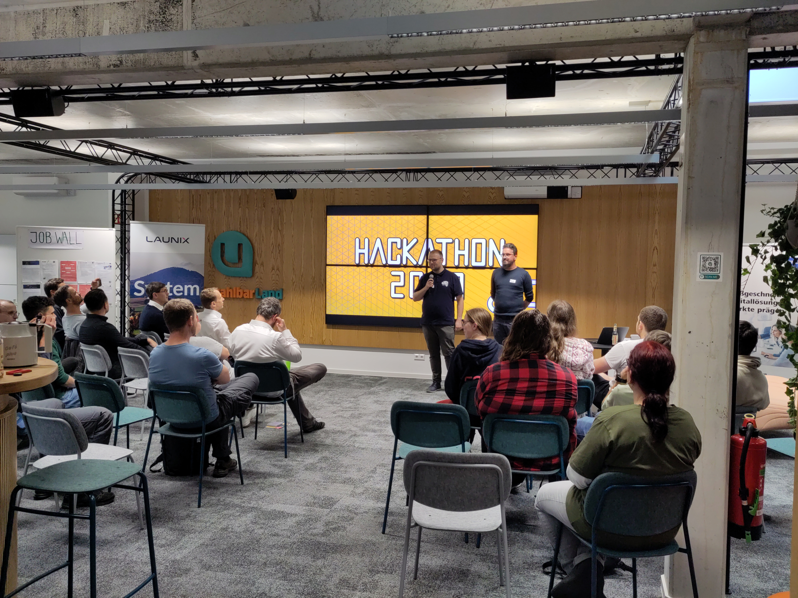
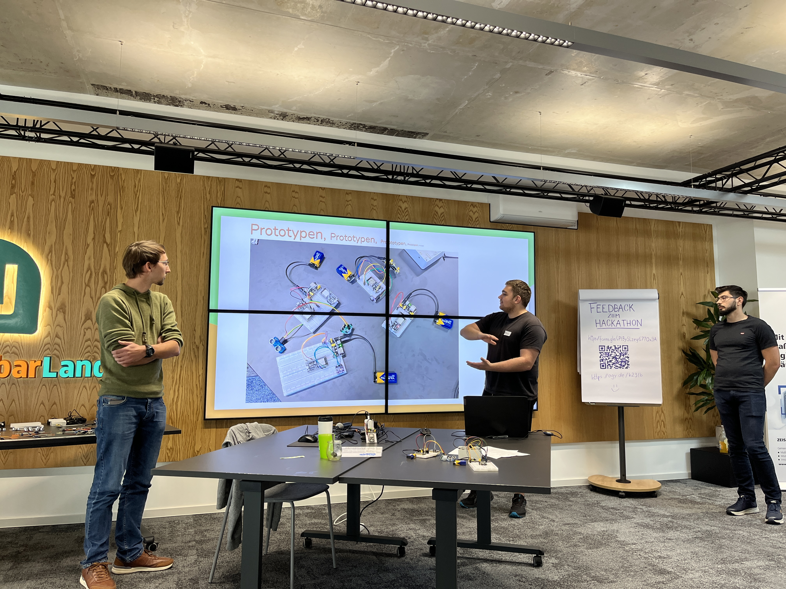
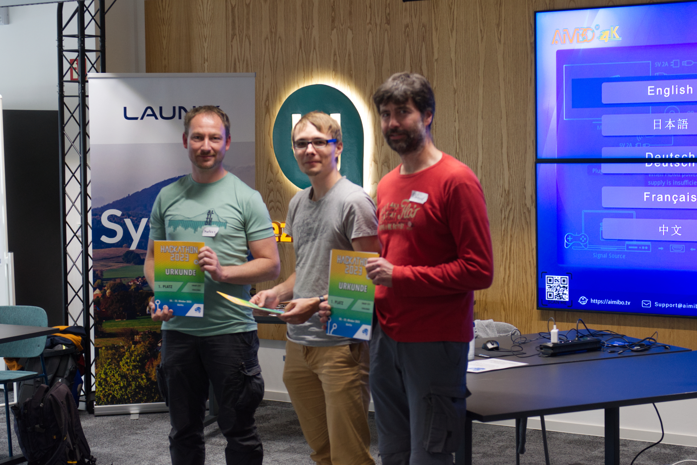
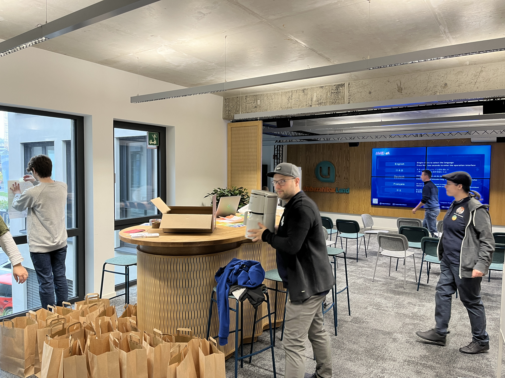
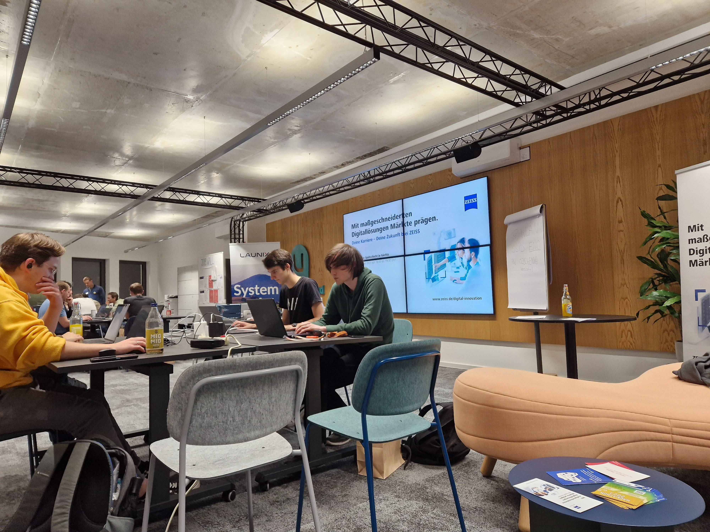
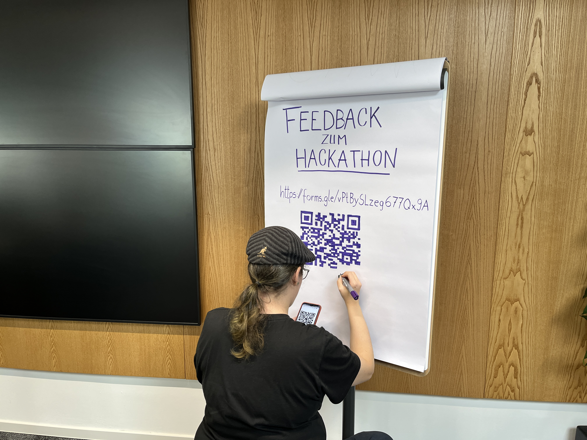
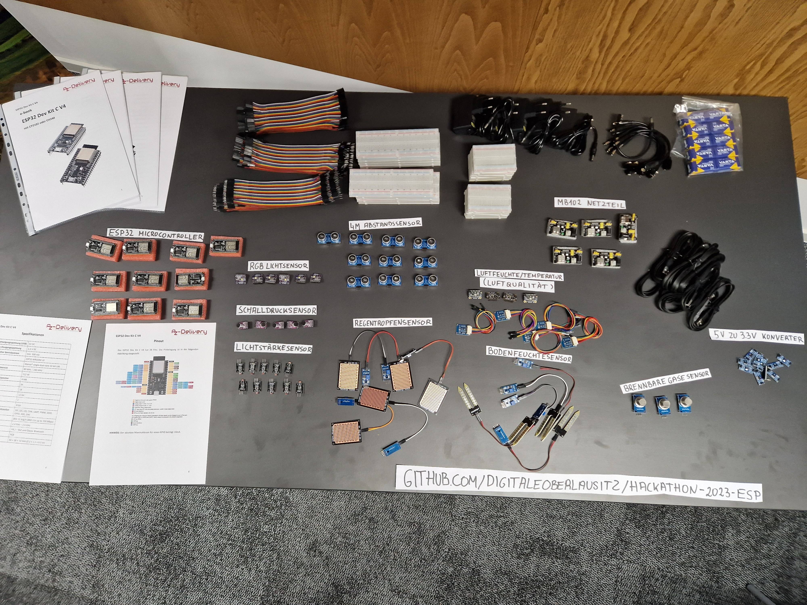
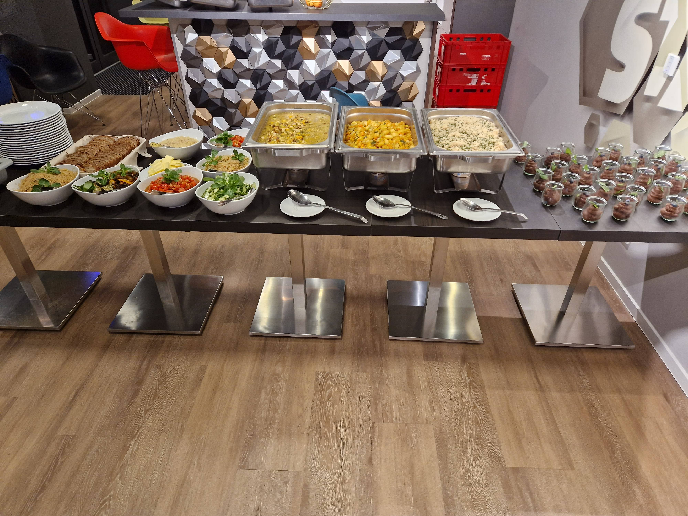

Nach einem inspirierenden und arbeitsreichen Wochenende geht unser [Hackathon 2023](https://hackathon2023.digitale-oberlausitz.eu/) nun zu Ende.
Wir sind begeistert von den Ideen, die die Teilnehmer in kurzer Zeit entwickelt haben.
Im Zentrum stand die Herausforderung, wie Daten und Technologie genutzt werden können, um das Leben in unserer Region zu verbessern.

<!--more-->

Zur Eröffnung durften wir nach einer kurzen Eröffnungsrede des Vereinsvorsitzenden Manuel Mauky,
den Oberbürgermeister von Görlitz, Octavian Ursu begrüßen,
der neben einigen Grußworten auch die Sicht der Stadt und der Verwaltung auf das Thema "Digitalisierung"
und damit verbunden auch "Smart City" dargelegt hat. Es kam dabei zum Einen der große
Bedarf an Digitalisierung und damit auch Menschen, die diese Digitalisierung vor Ort voran treiben und
zum Anderen auch die Bereitschaft zum Ausdruck, Vorschläge und Ideen von verschiedensten Akteuren
anzunehmen, womit sich auch die Teilnehmenden des Hackathons mit ihren Projekten angesprochen fühlen durften.

Desweiteren haben zur Eröffnung Sven Mimus, Geschäftsführer der Entwicklungsgesellschaft Niederschlesische Oberlausitz ENO und 
Prof. Dr. Jörg Lessig vom Fachbereich Informatik der Hochschule Görlitz/Zittau weitere Perspektiven zum Thema der Digitalisierung und 
Smart City eingebracht.

Nach der Eröffnung und der Vorstellung unserer Sponsoren, 
ging es in die praktische Arbeit. Der erste Schritt war die Ideenfindung:
Dabei waren mindestens zwei Verschiedene Wege der Annäherung an das Thema möglich.
Zum Einen eine Diskussion über das Thema "Smart City", was man darunter alles verstehen kann
und welche Probleme es denn zu lösen gäbe. Hierbei gab es auch externen Input 
von Autohausbesitzer Silvio Arndt, der eine Idee für ein neues Mitfahrt-Angebot vorstellte.
Der andere Weg führte über die Technik: Wir hatten zum Hackathon eine Reihe von
Microcontrollern sowie Sensoren für z.B. Luftqualität, Lautstärke, Abstand, Bodenfeuchtigkeit und
Helligkeit mitgebracht und den Teilnehmenden vorgestellt.
Dies konnte dann auch zur Inspiration dienen, was mit diesen und weiteren Hilfsmitteln
gemacht werden konnte.

Mit der Ideenfindung haben sich auch 3 Teams gefunden und der restliche Freitagabend
wurde für die ersten Schritte und insbesondere zum Vertrautmachen mit den Sensoren und Microcontrollern genutzt.
Der Samstag war schließlich für die eigentliche produktive Arbeit an den Projekten
angedacht, wobei wir als Verein wo immer möglich unterstützt haben.
Am Sonntag schließlich mussten die Projekt-Präsentationen vorbereitet und letzte
Schritte bei der Fertigstellung der Projekte gemacht werden.

Zur Abschlusspräsentation mussten die Teams ihre Lösungen dem Publikum, bestehend 
aus den anderen Teilnehmenden, dem Orga-Team und einigen Gästen, inklusive Vertretern der
Sponsoren, vorstellen.
Die Kriterien zur Bewertung waren:

- Kreativität und Originalität
- Technischer Anspruch und Umfang
- Nachhaltigkeit und Nutzen für die Allgemeinheit
- Präsentation und Dokumentation
- Funktionsfähigkeit und Lauffähigkeit

Anhand dieser Kriterien gab es ein Publikums-Voting und eine separate Jury-Bewertung, 
wobei beide zu je 50% auf das Gesamtergebnis einzahlen.
Die Jury bestand wiederum zu 50% aus Vertretern der Sponsoren und zu 50% aus Vereinsmitgliedern des Digitale Oberlausitz e.V.,
insbesondere des Vorstands des Vereins.

# Ergebnisse

## Smarte Ampelsteuerung
Im ersten Projekt wurde eine intelligente Straßenbeleuchtung entwickelt, die automatisch abschaltet, wenn keine Passanten oder Fahrzeuge in der Nähe sind. 
Hierbei kamen eine Reihe unserer bereitgestellten Sensoren und Mikrocontroller zum Einsatz. 
Die Teilnehmer tobten sich mit Schallpegel-, Lichtstärke- und Abstandssensoren aus. 
Sie entwickelten eine IoT-Lösung auf Basis von [MQTT](https://de.wikipedia.org/wiki/MQTT) und [AWS](https://de.wikipedia.org/wiki/Amazon_Web_Services), 
um eine flexible Beleuchtung zu schaffen, bei der "auch das BackEnd skalieren kann" (sagen die Informatiker). 
Vielleicht hat sie der ein oder andere Autofahrer bei unser diesjährigen Location, der UnbezahlbarLounge der ENO bei Innolabs, an der Straße gesehen.

*Der Verein meint: In diesem Projekt arbeiteten Sensoren, Mikrocontroller und Cloud-Technologien Hand in Hand. 
Die Fähigkeiten, solche Systeme aufzubauen, zu skalieren und zu warten sind in der Industrie gerade sehr gefragt. 
Hier brauchen Informatiker, Automatisierungstechniker, Anlagenbauer, Maschinenbauer, etc. ein gemeinsames Verständnis, 
was geht, wie es geht und was möglich ist.*

Link zum Github-Repo: https://github.com/dudziec/hackathon2023-frischefische

## Smartes Mitfahren
Das zweite Projekt widmete sich einer Lösung für die sogenannte "letzte Meile" des öffentlichen Personennahverkehrs. 
Es wurde eine App entwickelt, die Autofahrer, die sowieso eine bestimmte Strecke fahren, mit Nicht-Autofahrern verbindet, die das gleiche Ziel haben. 
Der Autofahrer gibt sein Ziel in die App ein, genauso wie der Nicht-Autofahrer. 
Die App matcht dann die beiden Personen, sodass der Nicht-Autofahrer eine spontane(!!) Mitfahrgelegenheit zum gewünschten Ziel erhält. 
Diese Idee ist eine Möglichkeit, die Lücke zwischen zwei ÖPNV-Systemen zu schließen. 
Als Beispiel diente hier die Strecke zwischen Niesky und Görlitz. 
Die App wurde dabei speziell so gestaltet, dass sie auch für ältere Personen leicht bedienbar ist, die kein Auto mehr fahren, 
aber dennoch gelegentlich mobil sein müssen, beispielsweise für Arztbesuche.

*Der Verein meint: Bei großen Anbietern muss die Fahrt im Voraus gebucht werden. Das hat wenig Raum für Spontanität. 
Bei dieser Art der digitalen Nachbarschaftshilfe sollte die Regionalität und Spontanität über dem kommerziellen Interesse der Anbieter stehen.*

Link zum Github-Repo: https://github.com/supermarche/flotteLotte

## Smart City Dashboard
Das dritte Projekt im Hackathon war die Entwicklung eines Dashboards mit lokalem Bezug, 
das eine übersichtliche Anzeige von wichtigen lokalen Informationen und Ereignissen bietet und so den Bürgern hilft, 
besser über das Geschehen in ihrer Umgebung informiert zu sein. 
Ein großer Vorteil dieses Dashboards ist seine Erweiterbarkeit durch Widgets, 
mit denen individuelle Anpassungen und Erweiterungen des Funktionsumfangs sehr einfach umgesetzt werden können.

Die Widgets des Dashboards sind dazu in der Lage, Websites abzufragen und so bereits öffentlich verfügbare Daten zusammenzutragen. 
Im Rahmen des Projekts wurden beispielsweise die Zugverbindungen zwischen Görlitz und Dresden sowie der Baustellen-Melder 
bei den Königshainer Tunneln abgefragt und die gesammelten Informationen direkt im Dashboard angezeigt.
Im Rahmen des Dashboard-Projekts wurde auch ein Widget implementiert, das Sensordaten verarbeiten kann.

*Der Verein meint: Das Dashboard-Projekt hat uns insbesondere hinsichtlich Design und Styling gefallen.
Wir sehen auch Potential für die Integration von KI-Systemen wie ChatGPT oder DALL-E in ein Dashboard. 
Man könnte sich beispielsweise täglich ein vom KI-System generiertes Bild anzeigen lassen. 
Ein konkretes Beispiel könnte "Das KI-Bild des Tages: So stellt sich DALL-E ein Umgebindehaus vor" sein, wodurch nicht nur informative, 
sondern auch unterhaltsame und kreative Elemente in das Dashboard integriert würden.*

Link zum Github-Repo: https://github.com/JonathanZopf/hackathon-23

## Danksagung
Nach einem inspirierenden Wochenende endet unser Hackathon 2023. Wir möchten an dieser Stelle Allen danken, die zum Erfolg beigetragen haben. 
Ein besonderer Dank geht an:

Das [UnbezahlbarLand](https://unbezahlbar.land/) / ENO für die Bereitstellung der Räumlichkeiten und [InnoLabs](https://www.innolabs-goerlitz.de/) für die Nutzung der Cafetaria. 
Diese haben einen wesentlichen Beitrag zur guten Athmosphäre geleistet.

Für ihre Redebeiträge zur Eröffnungsveranstaltung an 
- Octavian Ursu, Oberbürgermeister der Stadt Görlitz
- Sven Mimus, Geschäftsführer der Entwicklungsgesellschaft Niederschlesische Oberlausitz mbH (ENO)
- Prof. Dr. Jörg Lessig, Fachbereich Informatik der Hochschule Zittau/Görlitz

Unsere Sponsoren:

- [Unbezahlbarland / ENO](https://unbezahlbar.land/)
- [Hochschule Zittau/Görlitz](https://www.hszg.de/)
- [Launix](https://launix.de/)
- [ZEISS Digital Innovation](https://www.zeiss.de/digital-innovation)
- [FEV etamax GmbH](https://www.etamax.de/)
- [Innolabs](https://www.innolabs-goerlitz.de/)
- [SednaSoft](https://sedna-soft.de/)
- [Tallence AG](https://www.tallence.com/)
- [tragwerk](https://tragwerk-goerlitz.de/)

Außerdem Ralph Wielsch für die Unterstützung bei Versicherungsfragen.

Wir freuen uns bereits auf den nächsten Hackathon 2024 :)

## Weitere Impressionen

