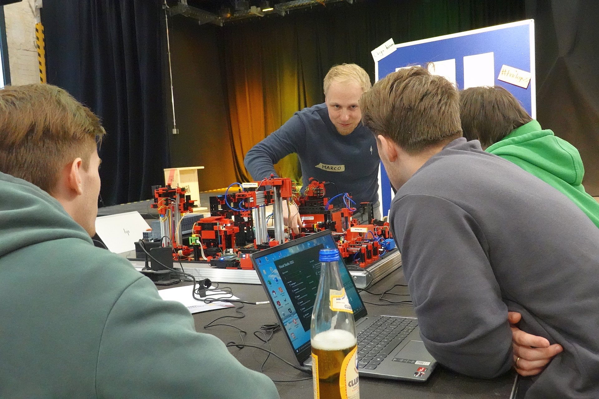
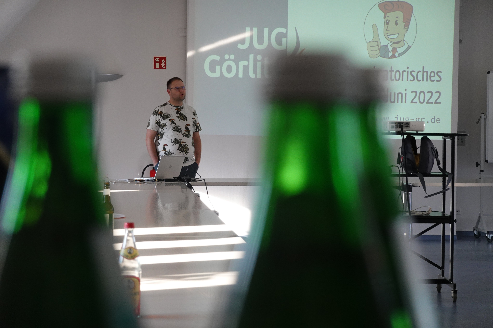
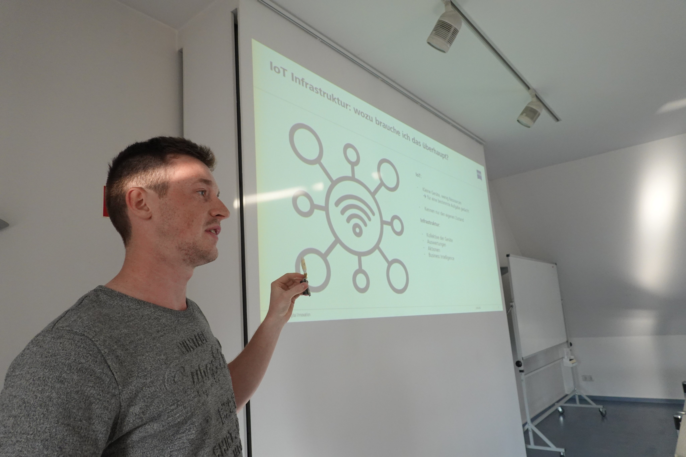

Trotz des ruhigen ersten Halbjahres konnten wir in der zweiten Jahreshälfte 2022 einige Veranstaltungen an den Start bringen. 

Zu den absoluten Highlights gehörte sicherlich unser Hackathon im Oktober, bei dem größtenteils Studierende der örtlichen Hochschule fünf sehr grundverschiedene Challenges bearbeiten konnten. Eingereicht wurden die Challenges von Firmen und Vereinen aus Görlitz. In den Räumen des Zentrums für Jugend- und Soziokultur "Rabryka" konnten sich unsere Teilnehmenden ganz den Herausforderungen von Open Data, Industriesteuerungen, Online-Verträgen, Testdatengeneratoren und Nachrichtenverteilungen widmen. In einer Atmosphäre voller Motivation und Kreativität entstanden in kurzer Zeit [praktische Lösungen und Ideen](https://hackathon2022.digitale-oberlausitz.eu/results). Dank unseren Fördermitgliedern und Sponsoren stand allen eine Verpflegung über das gesamte Wochenende bereit.
Letztlich war der Hackathon ein großer Erfolg und wir haben viel Zuspruch erhalten, sodass wir die Veranstaltung im Herbst 2023 gerne wiederholen möchten.

<!--more-->

Nach langer Corona-Unterbrechung konnten wir uns im Juli endlich wieder persönlich zu unserer Java User Group verabreden und Vorträgen über IoT, Industrie 4.0 und KeyCloak lauschen. 

Auch unsere regelmäßigen Chaostreffs, bei denen wir uns in lockerer Atmosphäre getroffen haben, haben wir lieb gewonnen.

Unsere Vereinsmitglieder haben sich voller Engagement in ihre Ämter gestürzt und dafür gesorgt, dass alles reibungslos ablief. Auch die Unterstützung unserer Sponsoren und Partner hat dazu beigetragen, dass wir unsere Veranstaltungen erfolgreich durchführen konnten. Ein besonderer Dank geht an:

* *Carl Zeiss Digital Innovation GmbH* (Fördermitglied)
* *SednaSoft* (Fördermitglied)
* *Drantos* (Fördermitglied)
* *InterNexum GmbH* (Fördermitglied)
* *Second Attempt e.V.*
* *InnoLabs Görlitz GmbH*
* *Hochschule Zittau/Görlitz*
* *Europastadt GörlitzZgorzelec GmbH*

Wir danken allen Mitgliedern für ihre Treue und ihren Einsatz und freuen uns auf ein weiteres erfolgreiches Jahr 2023 mit euch!