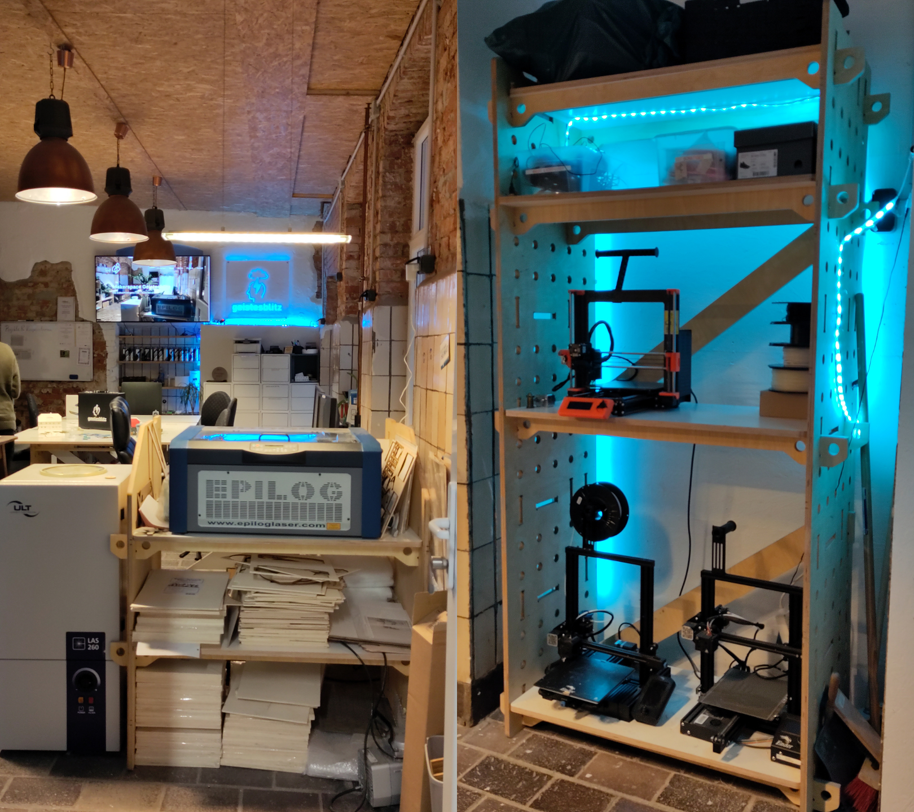

In der sächsischen Stadt Löbau findet ein Strukturwandel statt, der durch den Einsatz engagierter Akteure wie dem Verein [LÖBAULEBT](https://loebaulebt.de/) vorangetrieben wird. Dieser Wandel ist besonders wichtig, da Löbau, wie viele Städte der Oberlausitz, mit Abwanderung und schwindender Attraktivität kämpft.

Der Verein LÖBAULEBT wurde im Herbst 2015 von sechs jungen Männern gegründet, die das kulturelle Angebot in Löbau verbessern wollten. Sie entschieden sich für ein "Testprojekt": eine Ausstellung im Gewandhaus, die im Mai 2016 stattfand und großen Zuspruch erhielt. Nach diesem Erfolg gründeten sie den Verein und begannen, verschiedene Veranstaltungsformate in der Stadt zu organisieren, darunter Jugendforen, Oktoberfeste, Straßenfeste und Kinovorführungen. Anfang 2019 bezog der Verein schließlich seine eigenen Räumlichkeiten in der Bahnhofstraße 26, wo der [Makerspace](https://loebaulebt.de/portfolio/makerspace-geistesblitz/) und ein [großer Veranstaltungsraum](https://loebaulebt.de/mieten/) eingerichtet wurden.

<!--more-->

In diesem Räumlichkeiten fand am 15.03.2023 eine Netzwerkveranstaltung statt, die von der [Digitalagentur Sachsen](https://www.digitalagentur.sachsen.de/LIfD.html) organisiert wurde. "Lokale Innovationsräume für Digitalisierung" (LIfD) wie Coworking-, Maker- und Hackerspaces, FabLabs und Digitallabore werden als wesentlich für die digitale Transformation der Gesellschaft angesehen, da sie Begegnung und Austausch über alle Generationen ermöglichen. Was theoretisch klingt, bedeutet in der Praxis: 3D-Drucker, Kunststoff-Extruder und VR-Brillen regen zum Mitgestalten an - und so der Umgang mit neuen Fertigungsmethoden erlernt. "Handwerk", das dann in die lokalen Unternehmen getragen werden kann. 

Wir fanden den Nachmittag bei der Netzwerkveranstaltung sehr spannend. Besondere Highlights waren die Führung durch den Makerspace (bei der ein Vereinsmitglied den unbedingten Wunsch verspürte, seine Lieblingsgebäude als 3D-Modelle auszudrucken), sowie die anschließende Diskussionsrunde. In dieser Runde wurde die Vernetzung von lokalen Handwerksbetrieben mit Makerspaces thematisiert und diskutiert, wie Synergien zwischen traditionellem Handwerk und digitalen Technologien gefördert werden können.
Zusammenfassend lässt sich sagen, dass der Strukturwandel durch das Engagement von Vereinen wie LÖBAULEBT maßgeblich vorangetrieben wird. Die Schaffung von Innovationsräumen und die Vernetzung von Akteuren aus unterschiedlichen Bereichen sind dabei entscheidende Faktoren für den Erfolg dieser Entwicklung.

