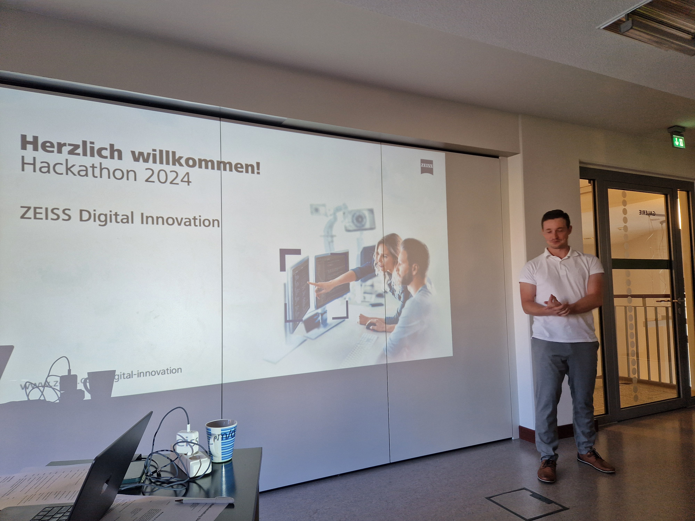

Am 18.10.2024 startete der nunmehr [3. Hackathon](https://hackathon2024.digitale-oberlausitz.eu) in der Stadtbibliothek Görlitz. Die thematische Ausrichtung hat dieses Jahr einen klaren Fokus auf Themen der nachhaltigen Stadtentwicklung bzw. auch Open-Data. Die Challenges waren einerseits aus einem Treffen der [TRUST](https://trust-goerlitz.de/)-Arena entstanden bzw. von der Europastadt [GörlitzZgorcelec GmbH](https://www.goerlitz.de/Europastadt-GoerlitzZgorzelec.html) zugearbeitet worden und andererseits von der [Erdmann Software GmbH](https://www.erdmannsoftware.com/) eingereicht worden.
Viele der Themen hatten einen Fokus zu Karten- oder Geo-Daten, die man aus offenen Datenquellen beziehen könnte, weswegen schnell die Idee entstand, Open-Data als gemeinsames Motto zu definieren. Außerdem sind alle Themen im Bereich der Nachhaltigkeit bzw. der nachhaltigen Stadtentwicklung einzuordnen. Es gab beispielweise Challenges zur Förderung von Urban Gardening, Reparierbarkeit, der Analyse von Dachflächen für die Eignung für Solaranlagen oder der Bewertung von Reparaturmaßnahmen im Gleisnetz der Eisenbahn. Schließlich war es die [Challenge zur Verarbeitung und Darstellung von Hitzeproblembereichen](https://hackathon2024.digitale-oberlausitz.eu/challenge-hitzeprobleme/), die Teilnehmenden am meisten überzeugt hat.

<!--more-->

Diese Challenge hat mit der Analyse und Aufbereitung von Satelitendaten, sodass diese für die Identifikation von Hitzeproblembereichen genutzt werden können, einen besonderen Anspruch an das Team gestellt. Die Teilnehmenden konnten nicht nur einen Problemlösungsansatz dafür finden, dass die benötigten Temperaturdaten zu grob aufgelöst waren, sondern sie konnten auch eine Visualisierung dieser Daten zusammengeführt mit anderen Kartendaten zeigen. Das Verständnis für diese naturwissenschaftliche Situation und die Analyse der zur Verfügung stehenden Daten und Mittel diese Aufzubereiten sind es was diesem Team besonders gut gelungen ist. Wir möchten daher auch unseren Respekt für das Team ausdrücken und freuten uns umso mehr, dass das verbleibende Geld der Sponsoren abzüglich aller Kosten für die Veranstaltung auf dieses Team aufgeteilt werden konnte.

Mehr Details zu den ünbrigen Challenges gibt es auf https://hackathon2024.digitale-oberlausitz.eu/challenges/.

Auch möchten wir noch allen Unterstützern danken, die zu dieser Veranstaltung beigetragen haben – insbesondere den Challenge-Ownern, welche einen inhaltlichen Beitrag lieferten und auch bei der Veranstaltung die Teilnehmenden direkt unterstützt haben. Auch unseren Sponsoren [Zeiss Digital Innovation GmbH](https://www.zeiss.de/digital-innovation), [SednaSoft](https://sedna-soft.de/), [Stadtwerke Zittau GmbH](https://stadtwerke-zittau.de) und der [ULT AG](https://www.ult.de/) möchten wir für ihre monetäre Unterstützung danken. Dank euch konnten wir die Veranstaltung mit umfangreichem Buffet, Getränken und auch mit einem Preisgeld für die Teams aufwerten.

Zuletzt möchten wir auf diesem Wege ein paar Eindrücke von der Veranstaltung in Bildern teilen.

