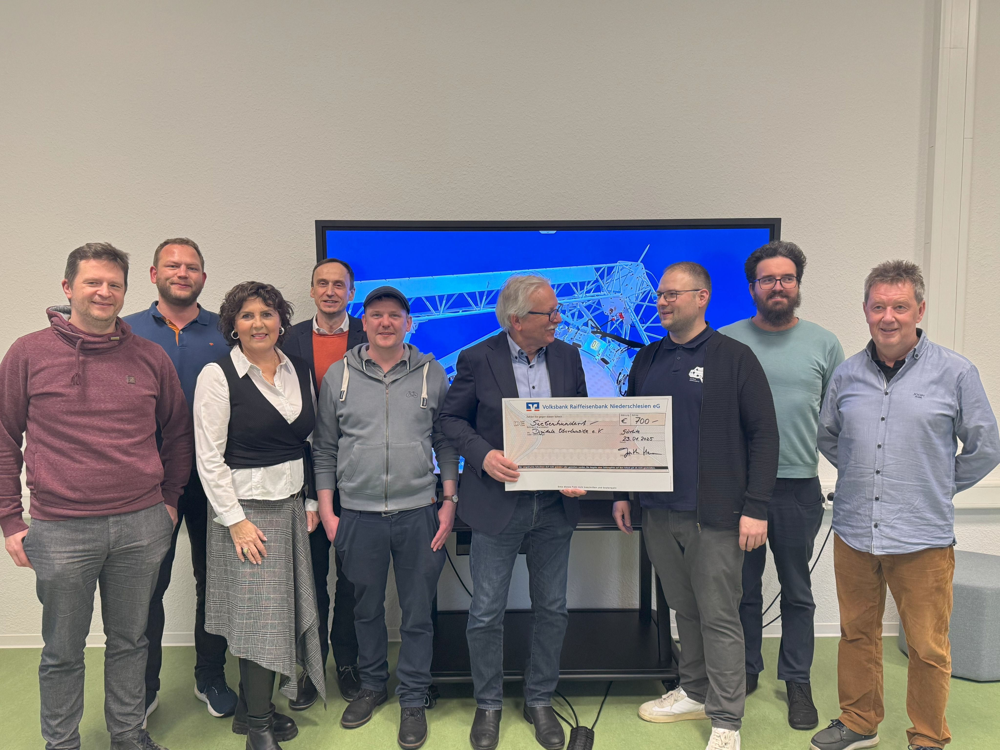

Am 23. Januar waren wir im Deutschen Zentrum für Astrophysik in Görlitz zu Gast, um eine Spende über 700 Euro von Günther Hasinger und Freunden des "*Deutschen Zentrum für Astrophysik Görlitz*" (DZA) entgegenzunehmen. 

Wir freuen uns sehr über diese Summe Geld und bedanken uns herzlich für diese großzügige Spende an unseren Verein und die Unterstützung unserer Bildungsveranstaltungen, die wir kontinuierlich treiben. In Abstimmung mit den Spendern wird dieses Geld für die Organisation des nächsten Hackathon (2025) eingesetzt werden.

<!--more-->

Wie kam es zu dieser Spende?

Liebe geht durch den Magen – und das Geld aus der Spenden-Kochaktion im Advent an zwei Vereine aus der Region. In Görlitz wird in der Adventszeit an 17 Tagen für wohltätige Zwecke gekocht, gegessen, getrunken und dafür gespendet. Die Aktion heißt „17 Tage, 17 Essen“. Im Jahr 2024 hat es erstmals einen 18. Kochtag gegeben. Der fand im "Sudost" in der Görlitzer Jakobstraße statt. Initiiert wurde die Aktion gemeinsam vom Görlitzer Axel Krüger und Günther Hasinger. Freunde des DZA kochten Dibbelabbes, eine ursprünglich im Saarland kreierte Variante von Kartoffelpuffern mit Speck, Zwiebeln und Lauch – unter Zugabe von Knoblauch und liebevoll garniert mit Petersilie.

Einige der inzwischen knapp 60 DZA-Mitarbeitenden haben am Samstag vor Weihnachten selbst mit angepackt, Zwiebeln geschnippelt oder Petersilie atomisiert und einen Abend im Advent nicht nur gemeinsam verbracht, sondern gleich noch Gutes bewirkt und so eine beeindruckende Spendensumme zusammenbekommen. Der zweite Teil der Einnahmen von Axel Krüger geht übrigens an die Görlitzer Segeljugend am Berzdorfer See. Damit unterstützt er Jugend und Sport rund um Görlitz.
 
Einen der Schecks in Höhe von 700 Euro übergab der designierte DZA-Gründungsdirektor Günther Hasinger an Mitglieder des Vereins Digitale Oberlausitz in Görlitz.

